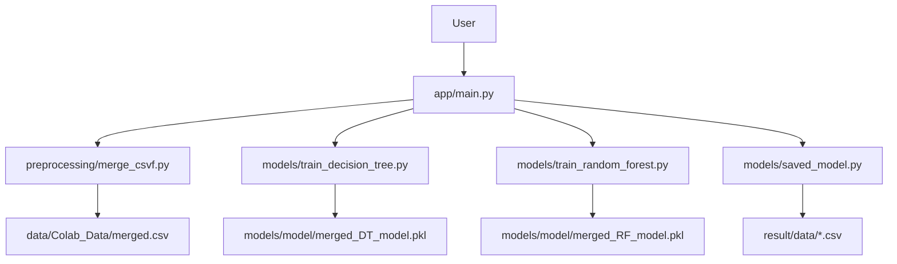
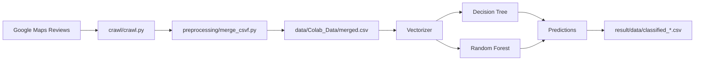
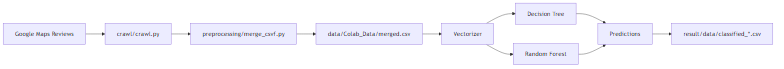
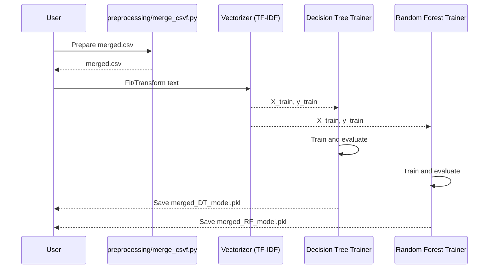
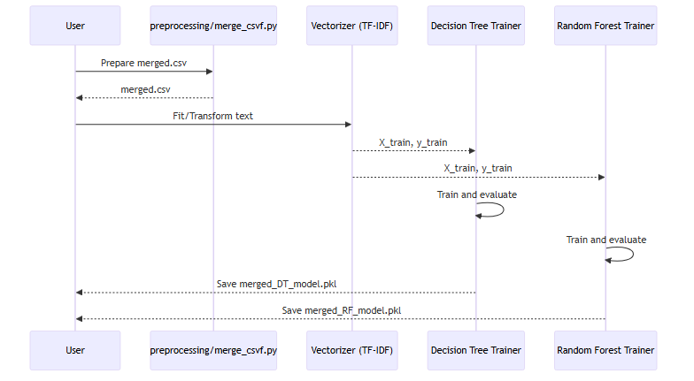
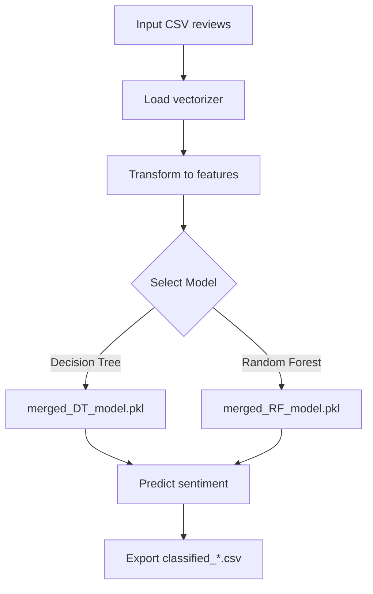
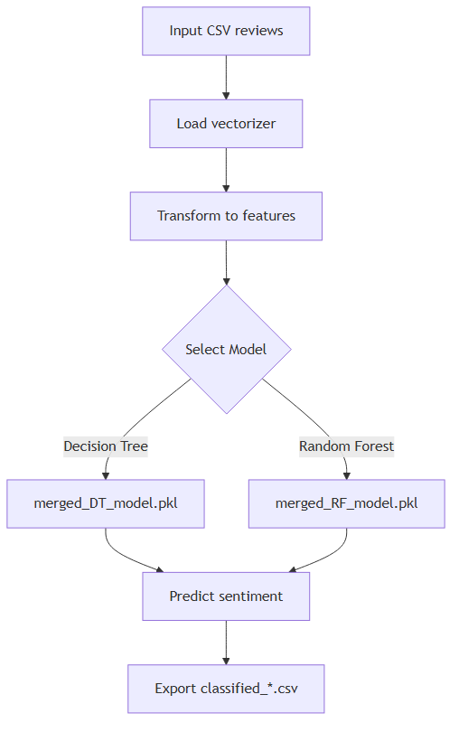
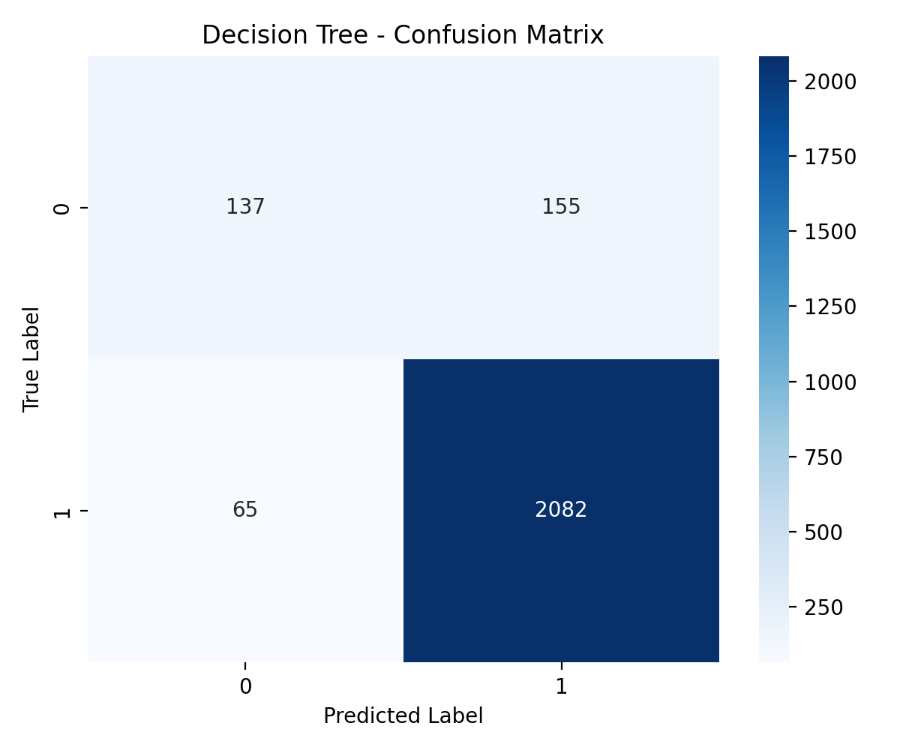
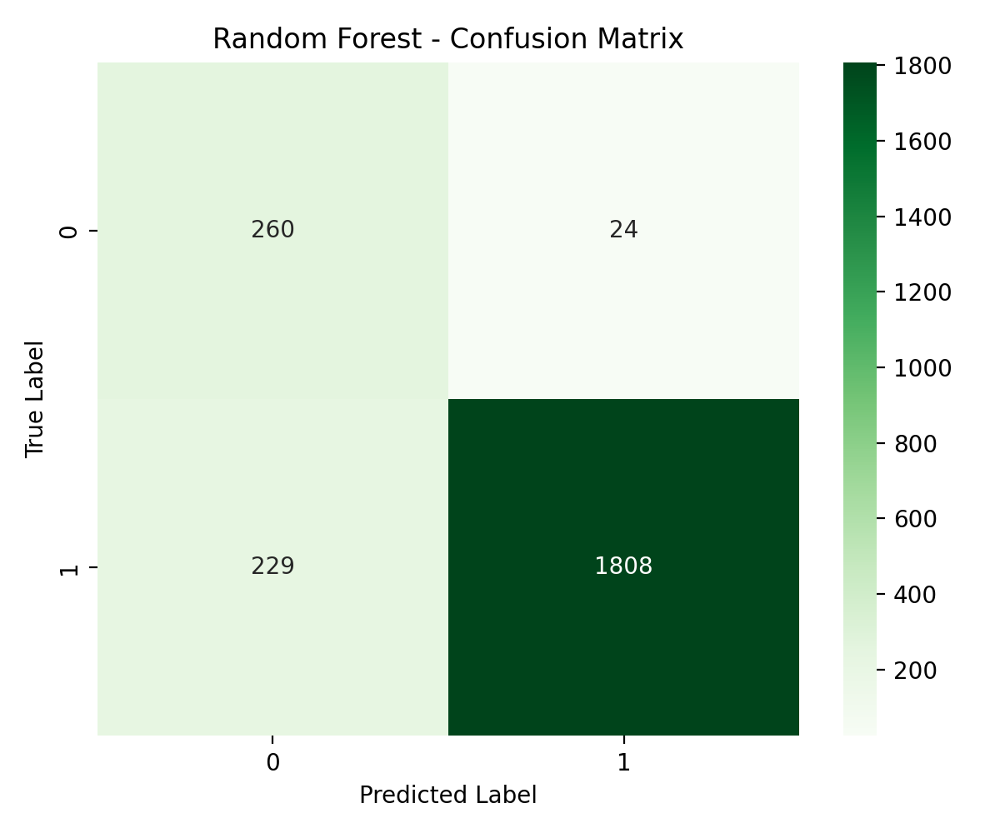
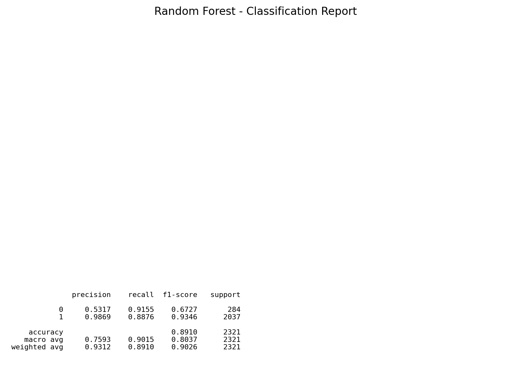

## Sentiment Classification: Decision Tree & Random Forest

### Mục lục

- [📌 Giới thiệu](#-giới-thiệu)
- [🎯 Mục tiêu](#-mục-tiêu)
- [🏗 Cấu trúc dự án](#-cấu-trúc-dự-án)
- [🛠 Công nghệ sử dụng](#-công-nghệ-sử-dụng)
- [🚀 Tính năng](#-tính-năng)
- [🔧 Cài đặt](#-cài-đặt)
- [📊 Trực quan hóa (Mermaid)](#-trực-quan-hóa-mermaid)
  - [Kiến trúc tổng quan](#kiến-trúc-tổng-quan)
  - [Luồng dữ liệu](#luồng-dữ-liệu)
  - [Pipeline huấn luyện](#pipeline-huấn-luyện)
  - [Pipeline suy luận](#pipeline-suy-luận)
- [📈 Trực quan hóa kết quả mô hình](#-trực-quan-hóa-kết-quả-mô-hình)
- [🧪 Sử dụng và ví dụ](#-sử-dụng-và-ví-dụ)
- [📚 Tài liệu tham khảo](#-tài-liệu-tham-khảo)
- [📞 Liên hệ](#-liên-hệ)

### 📌 Giới thiệu

Dự án thực hiện bài toán phân loại cảm xúc bình luận (Sentiment Analysis) bằng hai thuật toán học máy: Decision Tree và Random Forest. Quy trình gồm cào dữ liệu Google Maps, tiền xử lý, huấn luyện, suy luận và xuất kết quả.

### 🎯 Mục tiêu

- **Triển khai mô hình**: Decision Tree, Random Forest cho phân loại tích cực/tiêu cực.
- **Xây dựng pipeline**: cào dữ liệu → tiền xử lý → vector hóa → huấn luyện → đánh giá → suy luận.
- **Lưu/tải mô hình**: phục vụ tái sử dụng và suy luận hàng loạt.
- **Trực quan hóa**: kiến trúc, luồng dữ liệu, pipeline huấn luyện và suy luận bằng biểu đồ.

### 🏗 Cấu trúc dự án

```
BTL_Py/
│
├── app/
│   ├── main.py                     # Điểm vào chính để chạy pipeline
│   ├── test_neg_pos.py             # Top từ tích cực/tiêu cực
│   ├── check_important.py          # Từ quan trọng có ảnh hưởng
│   └── diagrams/                   # Biểu đồ Mermaid
│       ├── architecture.mmd
│       ├── data_flow.mmd
│       ├── training_pipeline.mmd
│       └── inference_pipeline.mmd
│
├── config/
│   └── keywords.py                 # Từ khóa dự phòng
│
├── preprocessing/
│   ├── crawl.py                    # Cào dữ liệu Google Maps
│   ├── crawl_batch.py              # Cào nhiều địa điểm
│   └── merge_csvf.py               # Gộp CSV và tiền xử lý
│
├── models/
│   ├── train_decision_tree.py      # Huấn luyện Decision Tree
│   ├── train_random_forest.py      # Huấn luyện Random Forest
│   └── saved_model.py              # Lưu/tải mô hình, vectorizer
│
├── data/
│   ├── raw_data/                   # Dữ liệu gốc
│   └── Colab_Data/                 # merged.csv sau tiền xử lý
│
├── result/
│   └── data/                       # Kết quả classified_*.csv
│
└── README.md
```

### 🛠 Công nghệ sử dụng

- **Python 3.10**
- **Selenium**: thu thập dữ liệu
- **Pandas, NumPy**: xử lý dữ liệu
- **Scikit-learn**: TF-IDF, Decision Tree, Random Forest
- **Joblib**: lưu/tải mô hình
- **NLTK, VaderSentiment**: xử lý ngôn ngữ tự nhiên, sentiment score
- **Matplotlib, Seaborn**: trực quan hóa dữ liệu

### 🚀 Tính năng

- Cào dữ liệu đánh giá Google Maps
- Tiền xử lý văn bản, gộp dữ liệu thành `merged.csv`
- Huấn luyện và lưu mô hình/Vectorizer
- Suy luận hàng loạt, xuất `classified_*.csv`
- Trực quan hóa pipeline và kiến trúc

### 🔧 Cài đặt

1. Clone dự án

```bash
git clone https://github.com/k4nnguyen/Decision-Tree-Random-Forest.git
cd Decision-Tree-Random-Forest
```

2. Tạo môi trường ảo và cài dependencies

```bash
python -m venv venv
"venv\Scripts\activate"
pip install -r requirements.txt
python features/setup_nltk.py
```

3. Chạy ứng dụng

```bash
cd app
python main.py
```

### 📊 Trực quan hóa (Mermaid)

#### Kiến trúc tổng quan



Ảnh PNG (dùng khi môi trường không hỗ trợ Mermaid):


#### Luồng dữ liệu



Ảnh PNG:



#### Pipeline huấn luyện



Ảnh PNG:



#### Pipeline suy luận



Ảnh PNG:



### 📈 Trực quan hóa kết quả mô hình

Sau khi chạy huấn luyện, các biểu đồ sẽ được lưu tại `result/visualizations/`:

- Decision Tree — Confusion Matrix: `result/visualizations/decision_tree_confusion_matrix.png`
- Decision Tree — Classification Report: `result/visualizations/decision_tree_classification_report.png`
- Random Forest — Confusion Matrix: `result/visualizations/random_forest_confusion_matrix.png`
- Random Forest — Classification Report: `result/visualizations/random_forest_classification_report.png`

Xem nhanh ngay tại đây:







Gợi ý: chạy lại các script huấn luyện để cập nhật các biểu đồ trên dữ liệu mới nhất:

```bash
python models/train_decision_tree.py
python models/train_random_forest.py
```

### 🧪 Sử dụng và ví dụ

- Huấn luyện mô hình: chạy `models/train_decision_tree.py` hoặc `models/train_random_forest.py` sau khi có `data/Colab_Data/merged.csv`.
- Suy luận: chạy `app/main.py` để tải mô hình và phân loại tập đánh giá, kết quả tại `result/data/`.
- Khám phá: dùng `app/test_neg_pos.py` và `app/check_important.py` để xem top từ khóa.

### 📚 Tài liệu tham khảo

- Selenium — `https://www.selenium.dev/`
- Scikit-learn — `https://scikit-learn.org/stable/`
- SERP API (Maps) — `https://serpapi.com/maps-local-results`
- Machine Learning Plus — `https://www.machinelearningplus.com`
- Tham khảo cách trình bày README và minh họa trực quan từ dự án tương tự: [YOLOv8 Detecting and Classifying Waste](https://github.com/k4nnguyen/YOLOv8_Detecting_and_Classifying_Waste)

### 📞 Liên hệ

- Tác giả: Nguyễn Kim An
- Email: annguyenne2906@gmail.com
- GitHub: `https://github.com/k4nnguyen`
